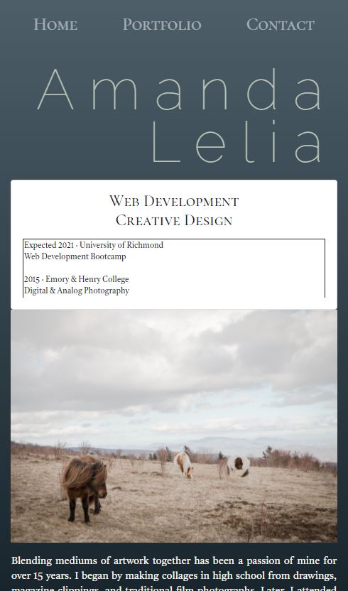

# 02-HW
Homework - Week 2: Responsive Portfolio

## Description

The assignment was to create a portfolio website using Bootstrap's responsive layout design. 

The project's inspiration comes from artist mock-up portfolio websites. I have a background in photography, lending itself to the perfect subject for this design. I wanted to push Bootstrap's layout elements to their limits while challenging myself to utilize stylistic choices I've learned in Bootcamp recently.

### Application Link

Deployed link: [https://awiehrs.github.io/02-HW/]

### Screenshot of Deployed Page

#### Credits

This project was completed while working with Austin Ruhf, some pieces of code may look similar